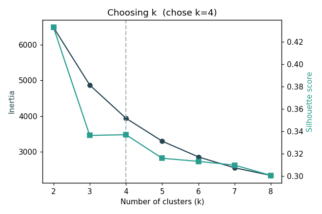
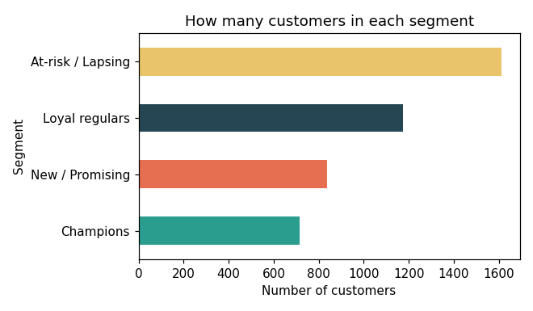
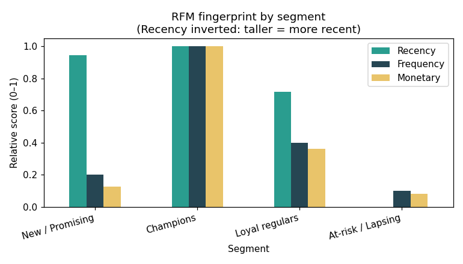
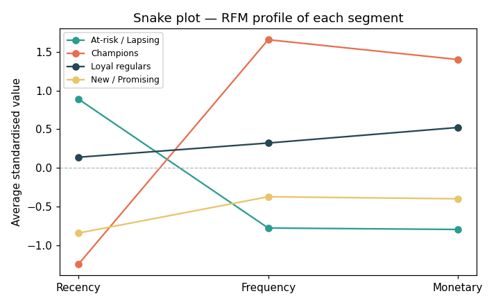
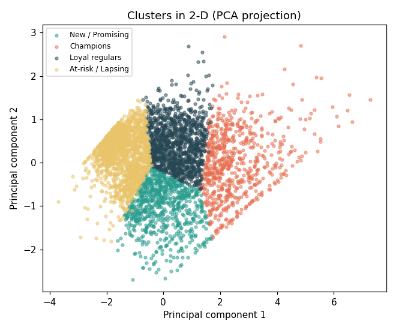
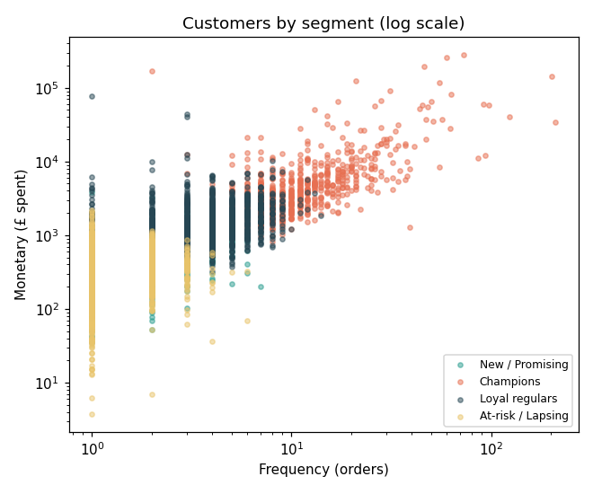
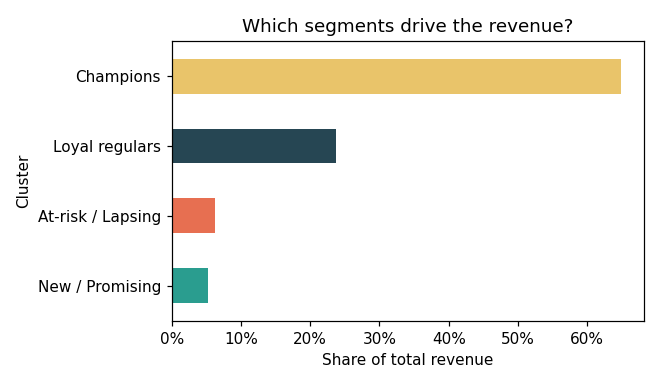

# Customer Segmentation — RFM + K-Means

Grouping an online retailer's 4,300+ customers into distinct behavioural
segments, so the business can market to each group differently — reward the
loyal, win back the lapsing, and nurture the newcomers. An end-to-end
**unsupervised** machine-learning project in Python: data cleaning, exploratory
analysis, RFM feature engineering, and K-Means clustering.

**Result:** four clear, actionable segments — from high-value **Champions** to a
large **At-risk / Lapsing** group — discovered without any labels, purely from
purchase behaviour. The headline finding: a **Champions** segment that is just
**16.5% of customers drives 65% of all revenue.**

The project deliberately shows **two segmentation approaches side by side** — the
traditional **rule-based RFM 1–5 scoring** and **K-Means** machine learning — and
sanity-checks the clusters against a second algorithm (hierarchical clustering).

---

## Problem

Not all customers are the same, but most businesses treat them as if they were —
sending everyone the same email. The goal here is to let the *data* reveal the
natural groups in the customer base, using only what every retailer already has:
a log of who bought what, and when.

Because there are no pre-existing labels ("this is a loyal customer"), this is an
**unsupervised** problem — a different family of machine learning from my
[churn-prediction project](https://github.com/MuhammadNasir-44/Customer-Churn-Prediction),
which was supervised classification.

## Dataset

[UCI "Online Retail"](https://archive.ics.uci.edu/dataset/352/online+retail) —
just over **half a million transactions** from a UK-based online gift-ware store,
Dec 2010 – Dec 2011. After cleaning: **397,884 transactions**, **4,338
customers**, **£8.9M** in revenue.

## Approach

1. **Cleaning** — removed cancelled orders (invoices starting with `C`), rows
   with no customer ID, and non-sales rows (zero/negative quantity or price).
2. **RFM feature engineering** — collapsed the transaction log into one row per
   customer with three classic behavioural features:
   - **Recency** — days since their last purchase (lower = better)
   - **Frequency** — how many separate orders they've placed
   - **Monetary** — total money spent
3. **Preprocessing** — RFM is heavily right-skewed (a handful of customers spend
   1000× the median), so I **log-transformed** then **standardised** the
   features before clustering — otherwise K-Means, a distance-based method,
   would be dominated by a few outliers.
4. **Choosing k** — used both the **elbow method** (inertia) and the
   **silhouette score** to pick the number of clusters.
5. **Rule-based RFM scoring** — as a traditional baseline, scored every customer
   **1–5** on each of R, F, and M (quintiles), giving a combined 3–15 score. This
   is the classic non-ML method — useful to contrast with the clustering.
6. **Clustering** — ran **K-Means** and profiled each cluster on its *original*
   (interpretable) RFM values, then named the segments in plain English.
7. **Model check** — re-clustered with **hierarchical (Agglomerative) clustering**
   and compared silhouette scores, to confirm the segments are real structure
   and not an artefact of one algorithm.

### Two approaches, compared

| Method | How it groups | Best for |
|--------|---------------|----------|
| **RFM 1–5 scoring** | Fixed business rules (quintiles) | Simple, transparent, no ML needed |
| **K-Means** | Learns natural groups from the data | Discovering structure you didn't define |

K-Means also comfortably beat hierarchical clustering on silhouette
(**0.34 vs 0.24** at k = 4) and scales to far larger customer bases, so it's the
model kept for the final segments.

## Choosing the number of clusters



The elbow in the inertia curve softens around **k = 4**, and while silhouette is
highest at k = 2, that only splits customers into "good" and "bad" — too coarse
to act on. **k = 4** keeps a healthy silhouette (0.34) while giving four segments
that map onto clearly different marketing actions. Choosing k is a balance
between statistical fit and business usefulness, and I chose the smallest k that
tells a genuinely useful story.

## The four segments



| Segment | Customers | Recency (days) | Frequency | Monetary (median) |
|---------|:---------:|:--------------:|:---------:|:-----------------:|
| 🏆 **Champions** | 716 | 8 | 10 | £3,734 |
| 🔁 **Loyal regulars** | 1,173 | 56 | 4 | £1,346 |
| 🌱 **New / Promising** | 837 | 17 | 2 | £472 |
| ⚠️ **At-risk / Lapsing** | 1,612 | 177 | 1 | £298 |

*(Median values per segment.)*






## Where the money actually is

Customer *count* and *revenue* tell very different stories. The **Champions**
segment is small but carries the business:



| Segment | Share of customers | Share of revenue |
|---------|:------------------:|:----------------:|
| 🏆 Champions | 16.5% | **64.9%** |
| 🔁 Loyal regulars | 27.0% | 23.7% |
| ⚠️ At-risk / Lapsing | 37.2% | 6.2% |
| 🌱 New / Promising | 19.3% | 5.2% |

This is the classic **80/20 (Pareto)** pattern — and it reframes the whole
strategy: **protecting Champions matters more than any single win-back
campaign**, because losing a few of them costs more than losing hundreds of
low-value lapsing customers.

## Business insights (what to *do* with this)

- **🏆 Champions (716 customers)** bought just 8 days ago, order ~10 times, and
  spend a median £3,734 — 5× the overall median. They are a small group driving a
  large share of revenue. **Action:** reward them (loyalty perks, early access),
  and never spam them with generic discounts — they'll buy anyway.
- **⚠️ At-risk / Lapsing (1,612 customers)** is the **largest** segment: they last
  bought ~6 months ago, ordered only once, and spent little. Many are one-time
  buyers drifting away. **Action:** targeted win-back campaign (a time-limited
  offer) — but cap the spend, since some will never return.
- **🌱 New / Promising (837 customers)** bought very recently but only once or
  twice. **Action:** onboarding and second-purchase nudges — this is where a
  small push has the best chance of creating a future Champion.
- **🔁 Loyal regulars (1,173 customers)** buy steadily at a solid value.
  **Action:** keep them engaged and gently upsell — they're the stable core.

The single biggest takeaway: **a large chunk of the customer base is already
slipping away**, while a small Champions group quietly carries revenue.
Segmentation turns one undifferentiated mailing list into four groups, each with
a different, obvious next action.

## Tech

Python · pandas · scikit-learn · matplotlib

## Run it

Two ways to explore this project:

- **Notebook** — [`customer_segmentation.ipynb`](customer_segmentation.ipynb) is a
  step-by-step walkthrough with the reasoning, tables, and charts rendered inline.
  Best for reading.
- **Script** — `segmentation_analysis.py` runs the full pipeline end to end.

```bash
pip install -r requirements.txt
python segmentation_analysis.py
```

The script downloads nothing — place `Online Retail.xlsx` in `data/` (from the
[UCI page](https://archive.ics.uci.edu/dataset/352/online+retail)). A segment
summary prints to the console, charts are written to `images/`, and a labelled
per-customer table (K-Means cluster **and** RFM 1–5 scores) is saved to
`customer_segments.csv`.
